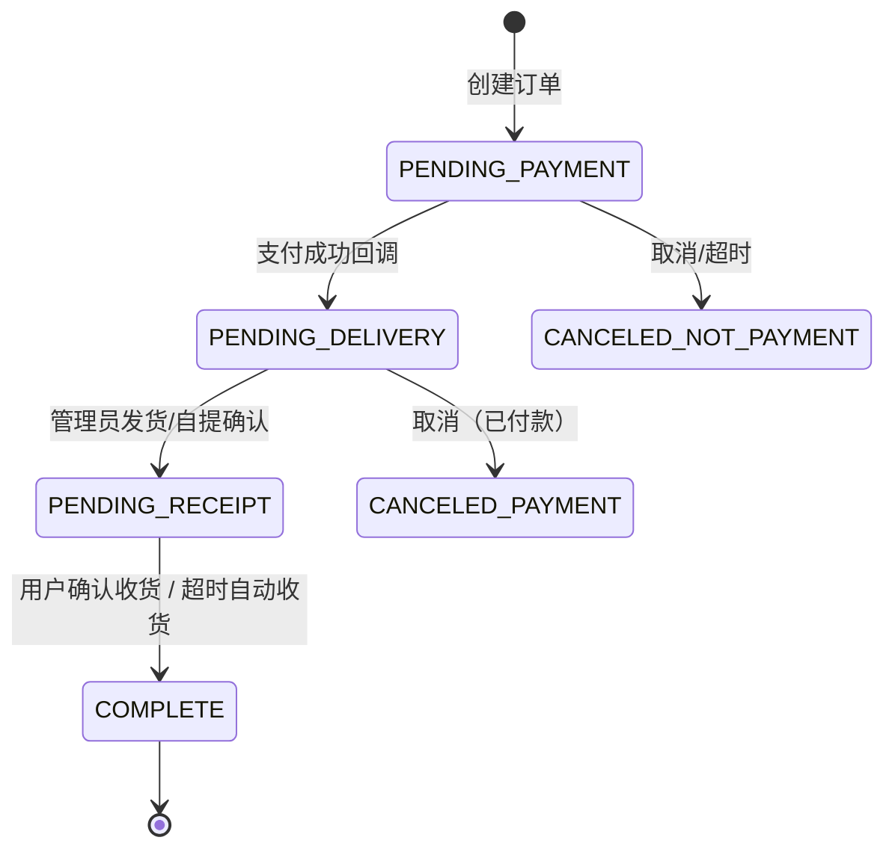
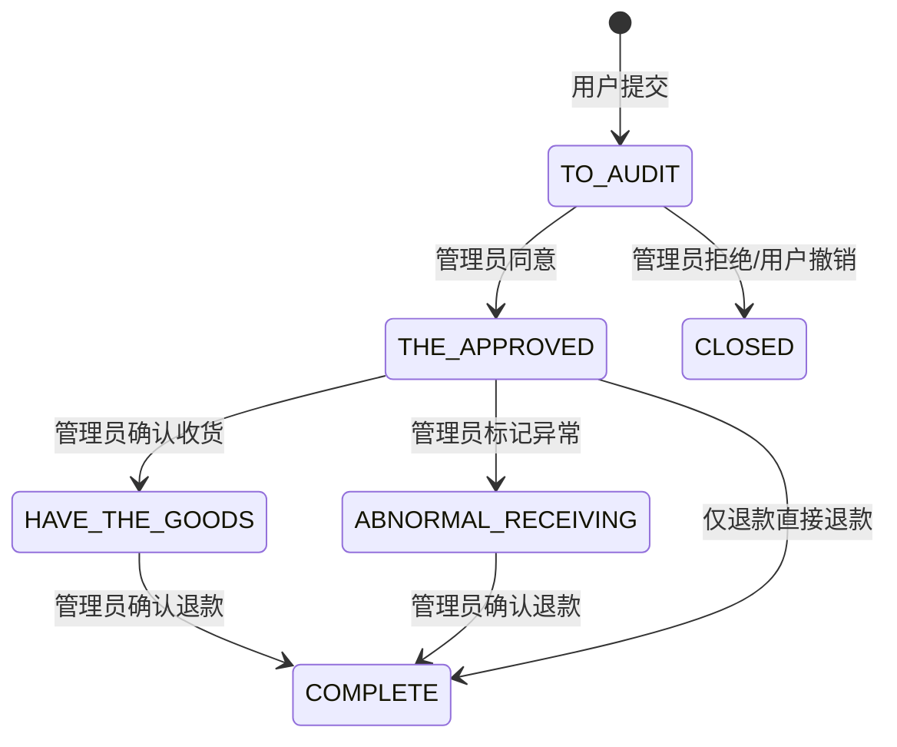
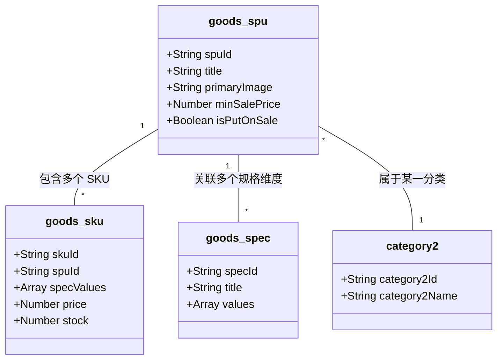

# 极简电商小程序

一个基于微信小程序 + CloudBase 的轻量电商内核：完整零售链路、可直接导入的演示数据、多租户 overlay、边界检查与开源治理配置。按本 README 初始化后，可以直接跑通首页、分类、详情、评论、下单、售后、门店自提、管理端发货等路径。

- 想最快跑起来 → 跳到 [快速开始](#rocket-快速开始5-步跑通-demo)
- 想了解功能边界 → 跳到 [完整功能](#sparkles-完整功能)
- 想看技术实现 → 跳到 [技术实现](#building_construction-技术实现)
- 想商业合作 → 跳到 [商业服务](#handshake-商业服务部署--二开--运维)

## :books: 文档导航

- [CloudBase 接入与初始化](./docs/CLOUDBASE_SETUP.md)
- [架构说明](./docs/ARCHITECTURE.md) · [设计系统](./docs/DESIGN_SYSTEM.md) · [二次开发约束](./docs/SECONDARY_DEVELOPMENT.md)
- [文档索引](./docs/README.md) · [FAQ](./docs/FAQ.md) · [TROUBLESHOOTING](./docs/TROUBLESHOOTING.md)
- [贡献指南](./CONTRIBUTING.md) · [安全策略](./SECURITY.md) · [行为准则](./CODE_OF_CONDUCT.md) · [更新日志](./CHANGELOG.md)

## :rocket: 快速开始（5 步跑通 Demo）

下面这 5 步是新用户从克隆仓库到看到带数据的首页 + 进入管理端的最短路径。

### 1. 安装依赖与开发者工具

```bash
npm install
cd miniprogram && npm install
```

然后用「微信开发者工具」打开本仓库根目录，菜单 `工具 -> 构建 npm`。

### 2. 配置 CloudBase 与租户

- 开通微信云开发，记下 `envId`
- 复制 [tenants/example/](./tenants/example/) 为你自己的 tenant 目录，填上 `envId / appId` 等差异项
- 执行 `npm run sync:tenant -- <your-tenant>` 生成本地运行配置
- 按 [docs/CLOUDBASE_SETUP.md](./docs/CLOUDBASE_SETUP.md) 创建数据模型并部署 [cloudfunctions/](./cloudfunctions/) 下的云函数

### 3. 上传演示图片到云存储

仓库内提供了一套现成的演示图片，源文件位于 [miniprogram/assets/mock/](./miniprogram/assets/mock/)，共 18 张：

- 首页 banner（2）：`banner-coffee.png` / `banner-gift.png`
- 一级 / 二级分类缩略（6）：`category-coffee.png` / `category-bakery.png` / `category-coldbrew.png` / `category-beans.png` / `category-bagel.png` / `category-gift.png`
- 商品主图（4）：`goods-coldbrew.png` / `goods-beans.png` / `goods-bagel.png` / `goods-gift.png`
- 商品详情图（4）：`detail-coffee-1.png` / `detail-coffee-2.png` / `detail-bagel-1.png` / `detail-gift-1.png`
- 评论头像（2）：`avatar-1.png` / `avatar-2.png`

做法：把这 18 张图片**保留原文件名**，全部上传到 CloudBase 云存储的 `mock/retail-demo/` 目录下。

### 4. 导入演示数据

演示数据位于 [cloudbase/bootstrap/](./cloudbase/bootstrap/)，共 8 份 JSON、合计 28 条记录：

| 文件                    | 集合 / 用途  | 记录数 |
| ----------------------- | ------------ | ------ |
| `category1.mock.json`   | 一级分类     | 2      |
| `category2.mock.json`   | 二级分类     | 4      |
| `goods_spu.mock.json`   | 商品 SPU     | 4      |
| `goods_spec.mock.json`  | 商品规格定义 | 4      |
| `goods_sku.mock.json`   | 商品 SKU     | 8      |
| `comments.mock.json`    | 商品评论     | 3      |
| `home_config.mock.json` | 首页运营配置 | 1      |
| `store.mock.json`       | 自提门店     | 2      |

导入步骤：

1. 把每份 JSON 中的占位前缀 `cloud://<your-env-id>.<your-bucket>/` 全局替换成你自己的环境真实前缀（envId 与 bucket 在 CloudBase 控制台「云存储」可以看到）
2. 按这个顺序在 CloudBase 数据模型控制台导入：`category1 -> category2 -> goods_spu -> goods_spec -> goods_sku -> comments -> home_config -> store`
3. 关系字段已经按 `_id` 编排好，导入完成即可在小程序里看到完整首页 / 分类 / 详情 / 评论

更详细的字段说明见 [cloudbase/bootstrap/README.md](./cloudbase/bootstrap/README.md) 与 [docs/CLOUDBASE_SETUP.md](./docs/CLOUDBASE_SETUP.md)。

### 5. 把自己设为管理员（看到管理端入口）

管理端能力（商品管理、订单发货、售后审核与退款等）在「个人中心」里通过条件渲染入口暴露：当 `user_info.role === 'admin'` 时，会出现「商家工作台 (管理员)」入口卡片。

目前**还没有提供专门的「提升为管理员」功能**，请按以下步骤手动开通（一次性操作）：

1. 在小程序里用要被设为管理员的微信号登录一次，触发自动建档（`cloudfunctions/login` 会在 `user_info` 集合写入这条记录）
2. 打开 CloudBase 控制台 → 数据模型 → `user_info`
3. 找到该记录（可按 `_openid` / 昵称定位），把字段 `role` 设为字符串 `admin`
4. 在小程序里下拉刷新「个人中心」，「商家工作台 (管理员)」入口即会出现

> 安全提示：`role` 字段没有任何前端写入入口，所有 `adminManage*` 云函数都会校验 `user.role === 'admin'`。请只把可信账号设为 admin。
>
> 已规划：通过专用云函数 + 白名单提供「一键自助开通 / 邀请码升级」，作为后续独立 PR。

完成以上 5 步后，新用户应该就能看到完整的演示首页、跑通下单链路、并以管理员身份进入管理端。

## :handshake: 商业服务（部署 / 二开 / 运维）

本项目采用 MIT 协议开源，**代码本身永久免费**，欢迎自行 fork 部署。

如果你是商家或团队，**没有研发能力或不想自己折腾**，需要以下任一服务，欢迎联系作者：

- **整套部署**：CloudBase 环境开通、小程序后台配置、云函数发布、域名/支付/物流接入，交付一个可直接上线运营的小程序
- **品牌定制**：按你的品牌色 / Logo / 文案 / 业务流程定制，租户级 overlay 不污染主干
- **二开外包**：在内核上扩展专属页面、云函数、对接自有 ERP / CRM / 第三方接口
- **长期运维**：版本升级、故障响应、数据备份、性能优化

**联系方式**：微信 `adroplv`，添加时**请注明「开源电商 + 来意（如：部署 / 二开 / 咨询）」**，否则可能不予通过。

<!-- 把二维码图片放到 docs/assets/wechat-qr.jpg 后即可显示；未放置时下面这行会显示破图，可以先注释掉。 -->
<p>
  
</p>

> 提 GitHub Issue 仅处理 bug 与功能讨论；商业合作请走微信。

## :sparkles: 完整功能

前台用户能力：

- **商品展示**：首页 banner + 多 tab 推荐位、一级 / 二级分类网格、商品详情（轮播图、规格弹层、详情图、评论摘要）
- **购物车 & 下单**：加购、规格选择、数量调整、结算页、地址选择、运费 / 应付金额服务端重算
- **支付与回调**：微信支付工作流、支付回调写入 `wechatPayInfo`、订单状态自动流转
- **订单流转**：待付款 → 待发货 → 待收货 → 已完成；支持取消、删除、确认收货、超时自动收货
- **售后**：单订单一条售后记录、可勾选多 SKU、申请 / 审核金额分别记录、退款工作流、退货物流回填
- **门店自提**：商品支持 `deliveryType=2`、自提门店配置、管理员确认提货
- **物流轨迹**：通过微信物流助手 OpenAPI 拉取轨迹（需租户在物流助手后台绑定）
- **个人中心**：地址管理、订单列表 / 详情、售后列表 / 详情、个人资料

管理端能力（在「个人中心 → 商家工作台 (管理员)」入口下）：

- 商品管理（SPU / SKU / 规格 / 分类）
- 订单管理（物流发货、自提确认）
- 售后管理（同意 / 拒绝、改金额、退款、收货标记）
- 库存与门店运营基础能力

工程与治理能力：

- 多租户 overlay：`tenants/default`、`tenants/example` 与 `sync:tenant` 脚本支持品牌差异化配置
- 边界检查脚本：`cloudfunctions:check`、`service-boundary:check`、tenant / style 检查
- husky pre-commit：拒绝私有租户文件入库、ESLint 校验
- 开源治理：Issue / PR 模板、`Quality Gate` workflow、Release workflow、CHANGELOG

## :building_construction: 技术实现

本节聚焦“代码是怎么组织的”——架构分层、命名约束、权限基线、订单 / 售后流转与数据模型。

### 1. 三层架构（Cloud-Service-Page）

- **Cloud 层**：CloudBase 云函数 + Data Model + 工作流，承担核心业务逻辑、权限校验、金额重算
- **Service 层**：[miniprogram/services/](./miniprogram/services/)，封装云端调用、数据清洗 / 格式化 / 状态映射
- **Page 层**：[miniprogram/pages/](./miniprogram/pages/)，只负责视图状态与用户交互，通过 service 接口拿数据

### 2. 命名与边界约束

- 管理端云函数：统一 `adminManage*`
- 用户侧写操作：统一 `manage*`
- 用户侧读操作：优先留在 `miniprogram/services/`，配合 CloudBase 权限与 `_openid` 过滤
- 特殊云函数：`login`、`createOrder`、`unifiedOrder`、回调、定时器、`generateQRCode`、`getLogisticsTrack` 走独立命名
- 页面与 `app.js`：**禁止**直接调用 `wx.cloud.callFunction` / `wx.cloud.database` / `cloudModels`，统一封装到 `miniprogram/services/`
- 样式：连字符命名（kebab-case）

仓库自带两条自动检查（`npm run check` 时一并执行）：

- `npm run cloudfunctions:check`：校验云函数命名 / 例外名单
- `npm run service-boundary:check`：校验 `app.js` / `pages/` 不直接触碰 CloudBase 读写 API

### 3. CloudBase 权限基线

按集合类型统一收紧权限，而不是逐页处理：

- **用户私有集合**（`cart` / `order` / `after-service` / `address` / `user_info`）：前端只读自己记录、不开放写权限，写操作走 `manage*` 云函数
- **运营集合**（`home_config` / `store`）：前端只读，修改通过管理端云函数或控制台
- **商品展示集合**（`goods_spu` / `goods_sku` / `goods_spec` / `category2` / `comments`）：前端按需开放只读，管理端写操作走 `adminManage*`
- **管理端能力**：统一走 `adminManage*` service + 云函数，云函数内部校验 `user.role === 'admin'`

## :brain: AI 协同与 Vibe Coding

本项目深度实践 **Vibe Coding**（氛围编程）：通过 AI 代理高度自动化地完成系统构建、实现与质量治理。

### 1. 强大的 MCP 扩展 (Model Context Protocol)

通过集成两大核心 MCP 服务，AI 获得了直接操作底层基础设施的能力：

- **CloudBase MCP**：允许 AI 直接管理云数据库（SQL/NoSQL）、部署云函数、管理云存储及配置安全规则。
- **TDesign MCP**：由 TDesign 团队提供，AI 可以直接获取最精准的 UI 组件文档、变更日志及 DOM 结构，确保 UI 实现的严丝合缝。

### 2. 智能化技能体系 (Skills & Rules)

为了保证 AI 输出的代码符合高标准的工业级要求，我们定义了严密的规则体系：

- **标准 Skills**：集成了 `miniprogram-development`、`cloud-functions` 和 `ui-design` 等 20+ 项专业技能，涵盖了从小程序开发到高端 UI 设计的全链路指南。
- **自定义 Rules**：
  - **日志规范**：强制要求在所有数据库操作及核心业务节点添加结构化日志，确保线上问题的可追溯性。
  - **语言契约**：统一使用中文进行技术交流与文档沉淀。
  - **架构一致性**：通过 `spec-workflow` 引导 AI 严格遵守三层架构设计，防止代码腐化。

### 3. Vibe Coding 在本项目中的使用方式

- **前端落地**：协助组织页面结构、组件调用与样式 token，使实现保持在 TDesign + 原生小程序能力这一主路径上
- **云开发实现**：协助梳理订单、支付、售后、物流等业务链路对应的 service、云函数与数据模型
- **设计与文档产出**：根据现有实现补齐设计系统、数据模型说明、FAQ、TROUBLESHOOTING 等文档
- **质量守护**：维护边界检查脚本、仓库治理配置与提交前校验，减少回归与误提交

## :arrows_clockwise: 订单与售后流转

订单状态枚举位于 `miniprogram/services/order/orderConfig.js`：



关键实现点：

- 支付入单：`unifiedOrder` 调用支付工作流；`paymentCallback` 写入 `order.wechatPayInfo` 并把订单更新为 `PENDING_DELIVERY`
- 发货 / 自提：物流单写 `order.logistics + shippedTime`；门店自提由管理员手动确认提货
- 确认收货：`manageOrder.confirmReceipt`；超时自动收货由 `confirmReceiptTimer`（默认 10 天）执行；售后进行中会跳过

售后流转（**单订单仅一条售后**，支持多 SKU 勾选）：



- 申请：`manageAfterService.apply`；同一订单已有售后会被拒绝
- 审核改金额：`after-service.applyAmount` / `audit.approvedAmount` / `amount` 三段式
- 退款：`adminManageAfterService.refund` 调用退款工作流，元 → 分换算并校验不超过 `wechatPayInfo.totalFee`

## :database: 数据模型概览

核心商品逻辑围绕 SPU / SKU / Spec：



- 商品模块：`goods_spu` / `goods_sku` / `goods_spec`
- 交易模块：`order` / `cart`
- 服务模块：`address` / `comments` / `after-service`
- 用户与运营：`user_info` / `home_config` / `store`

完整字段定义见 [DATA_MODELS.md](./DATA_MODELS.md)。

> 金额单位：业务层统一“元”；微信支付 / 退款工作流使用“分”，调用时做元 → 分换算并校验上限。

## :gear: 多租户与配置

本仓库以“**开源内核 + 私有 overlay**”模式运作。除 `tenants/default/` 与 `tenants/example/` 外，所有 `tenants/*/` 目录都被 `.gitignore` 忽略，并且 husky pre-commit 会拒绝任何私有租户文件入库——**生产敏感配置不会进入版本控制**。

新建租户：

```bash
cp -R tenants/example tenants/<your-brand>
$EDITOR tenants/<your-brand>/tenant.config.js   # 仅写差异项
cd miniprogram && npm run sync:tenant -- <your-brand>
```

关键路径：

- `tenants/default/tenant.config.js`：所有租户共享的公共默认值
- `tenants/example/tenant.config.js`：租户配置示例
- `tenants/<tenant>/tenant.config.js`：租户私有源配置；新增一个目录就是新增一个 tenant
- `miniprogram/config/runtime.js`、`cloudfunctions/*/config.private.js`：sync 脚本生成的运行时文件，已 `.gitignore`
- `miniprogram/app.template.json` / `sitemap.template.json` / `project.config.template.json`：开源模板；对应实际文件均为本地生成，不入库

> ⚠️ 严禁把真实的 `envId`、`appId`、手机号、商户号、收件地址写入 `tenants/example/` 或主仓任何文件。需要差异化时优先选择：① 配置项 → ②UI 覆盖点 → ③ 行为钩子 → ④fork（最后手段）。详见 [docs/SECONDARY_DEVELOPMENT.md](./docs/SECONDARY_DEVELOPMENT.md)。

## :rocket: 技术栈

- **前端框架**：微信小程序原生框架 (JavaScript / WXSS)
- **UI 组件库**：[TDesign Miniprogram](https://tdesign.tencent.com/miniprogram/)
- **后端服务**：微信云开发 (CloudBase) + 云函数
- **存储层**: 腾讯云云开发 文档型数据库
- **代码规范**：ESLint + Prettier

## :open_file_folder: 目录结构

```text
cloudfunctions/
├── adminManageAfterService/ # 管理端售后处理
├── adminManageOrder/        # 管理端订单发货/自提
├── createOrder/             # 服务端创建订单并重算金额
├── confirmReceiptTimer/     # 超时自动收货
├── getLogisticsTrack/       # 调用微信物流助手查询物流轨迹
├── manageAfterService/      # 用户售后申请/撤销/填写物流
├── manageAddress/           # 用户地址写操作
├── manageOrder/             # 订单取消/删除/确认收货
├── unifiedOrder/            # 下单支付工作流入口
├── paymentCallback/         # 支付回调
└── refundCallback/          # 退款回调

miniprogram/
├── components/             # 全局公共组件
│   ├── load-more/          # 加载更多组件
│   ├── price/              # 价格展示组件
│   └── webp-image/         # 支持 WebP 的图片组件
├── config/                 # 运行时配置入口
├── pages/                  # 业务页面
│   ├── admin/              # 管理端页面
│   │   ├── dashboard/      # 管理台入口
│   │   ├── goods/          # 商品管理
│   │   ├── order/          # 订单发货/自提
│   │   └── after-service/  # 售后管理
│   ├── home/               # 首页
│   ├── category/           # 分类页
│   ├── cart/               # 购物车
│   ├── goods/              # 商品模块 (详情、评价)
│   ├── order/              # 订单模块 (结算、列表、详情、售后)
│   └── usercenter/         # 个人中心 (地址管理、个人信息)
├── services/               # 业务接口服务
│   ├── admin/              # 管理端接口
│   ├── good/               # 商品相关接口
│   ├── cart/               # 购物车相关接口
│   ├── order/              # 订单相关接口（含用户侧订单/售后读操作）
│   └── address/            # 地址相关接口
├── style/                  # 全局公共样式
└── utils/                  # 工具类函数
```

## :memo: 开发建议

- **组件使用**：优先使用 TDesign 提供的标准组件，对简单结构使用原生 WXML + 全局公共样式，避免过度封装
- **数据交互**：业务逻辑统一封装在 `miniprogram/services/`，页面逻辑只负责数据绑定
- **代码校验**：执行 `npm run check` 会一并跑 ESLint、tenant / cloudfunctions / service-boundary 检查；提交前 husky 会拦截
- **基础库兼容**：小程序端按 ES2020 编写；若目标基础库不支持可选链等语法，请避免直接使用或自行转译
- **平台能力**：租户需自行开通并配置微信支付、退款工作流、微信物流助手、手机号 OpenAPI、小程序码 OpenAPI；物流公司 `code` 需与微信物流助手 `deliveryId` 一致
- **IDE**：建议使用微信开发者工具 + VSCode；AI 协同建议结合 GitHub Copilot 或 Codex / Claude Code

## :page_with_curl: 协议

本项目遵循 [MIT 协议](LICENSE)。

参考说明：项目最早参考过 [Tencent/tdesign-miniprogram-starter-retail](https://github.com/Tencent/tdesign-miniprogram-starter-retail) 启动，但当前仓库按现有实现独立维护。
