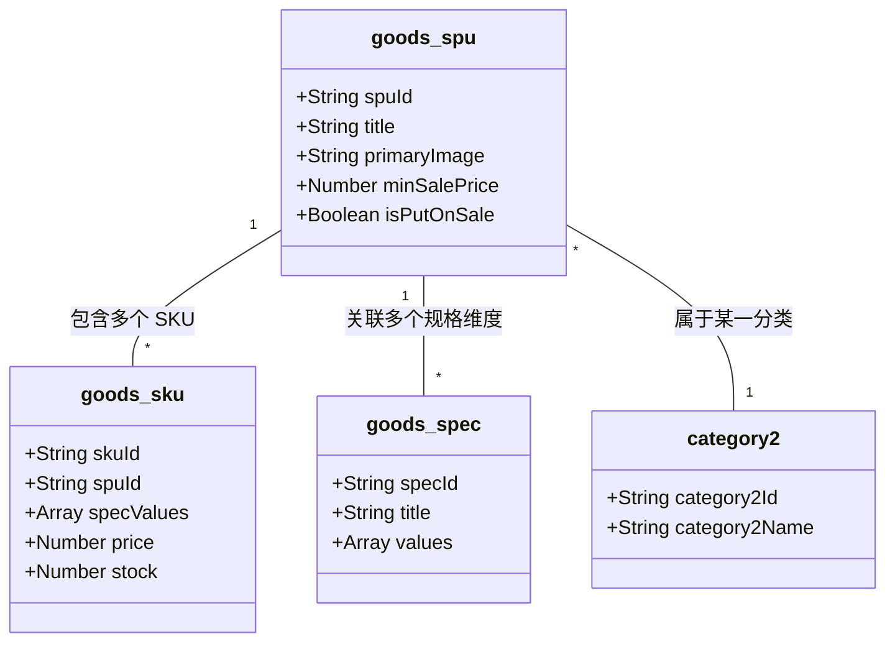
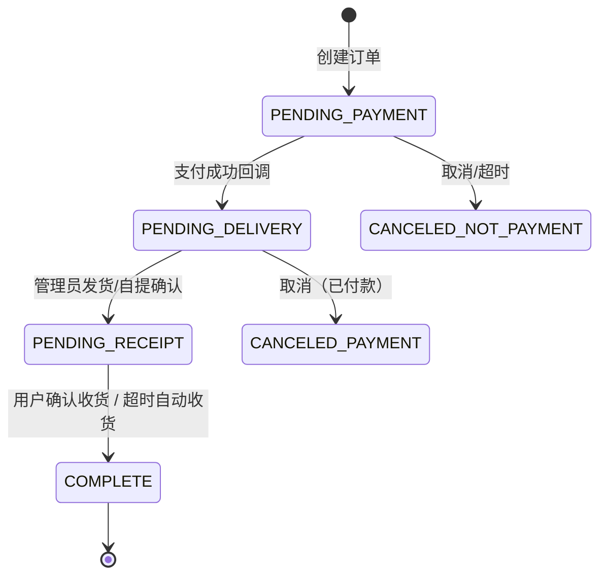
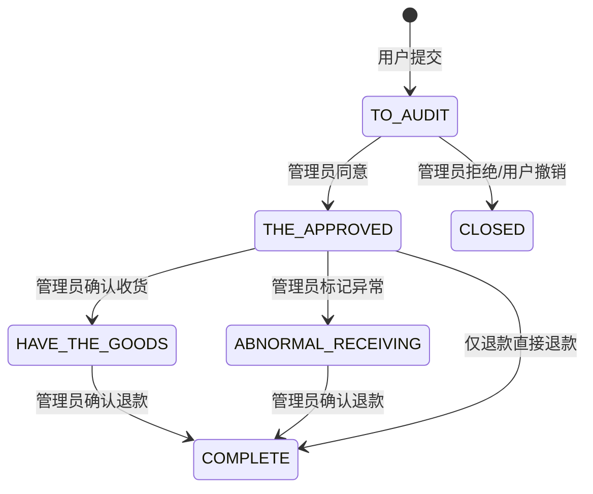

# 极简电商小程序

本项目是一个基于微信小程序与 CloudBase 的轻量电商内核。项目使用 TDesign Mini Program 作为组件库，但视觉系统、租户配置、云函数边界和数据模型约束都由本仓库维护，适合开源复用与私有租户定制。

当前仓库已经包含完整的前台零售链路、CloudBase 数据模型快照、云函数实现、多租户 overlay 配置、边界检查脚本、开源治理配置，以及一套可导入的默认演示数据。按文档初始化 CloudBase 环境后，可以直接跑通首页、分类、详情、评论、门店自提等核心路径。

## :books: 文档导航

- [文档索引](./docs/README.md)
- [架构说明](./docs/ARCHITECTURE.md)
- [CloudBase 接入与初始化](./docs/CLOUDBASE_SETUP.md)
- [设计系统](./docs/DESIGN_SYSTEM.md)
- [二次开发约束](./docs/SECONDARY_DEVELOPMENT.md)
- [开源准备清单](./docs/OPEN_SOURCE_CHECKLIST.md)
- [贡献指南](./CONTRIBUTING.md)
- [安全策略](./SECURITY.md) · [行为准则](./CODE_OF_CONDUCT.md) · [更新日志](./CHANGELOG.md)

## :rocket: 五分钟跑通演示数据

仓库内已经补了一套可直接用于体验和截图的默认演示数据，位于 [cloudbase/bootstrap/](./cloudbase/bootstrap/)。

- 可直接导入：`category1.mock.json`、`category2.mock.json`、`goods_spu.mock.json`、`goods_spec.mock.json`、`goods_sku.mock.json`、`comments.mock.json`、`home_config.mock.json`、`store.mock.json`
- 默认图片资源来源：`miniprogram/assets/mock/`；导入前请先上传到 CloudBase 云存储目录 `mock/retail-demo/`
- 图片字段占位格式：`cloud://<your-env-id>.<your-bucket>/mock/retail-demo/<filename>`
- 推荐导入顺序：`category1 -> category2 -> goods_spu -> goods_spec -> goods_sku -> comments -> home_config -> store`

导入后，你可以很快截出 4 组最关键的图：

- 首页：banner + tab 商品卡片
- 分类页：一级/二级分类网格
- 商品详情页：轮播图 + 规格弹层 + 评论摘要
- 门店/自提相关页：用于展示线下履约能力

更完整的导入说明见 [docs/CLOUDBASE_SETUP.md](./docs/CLOUDBASE_SETUP.md) 与 [cloudbase/bootstrap/README.md](./cloudbase/bootstrap/README.md)。

## :handshake: 商业服务（部署 / 二开 / 运维）

本项目采用 MIT 协议开源，**代码本身永久免费**，欢迎自行 fork 部署。

如果你是商家或团队，**没有研发能力或不想自己折腾**，需要以下任一服务，欢迎联系作者：

- **整套部署**：CloudBase 环境开通、小程序后台配置、云函数发布、域名/支付/物流接入，交付一个可直接上线运营的小程序
- **品牌定制**：按你的品牌色 / Logo / 文案 / 业务流程定制，租户级 overlay 不污染主干
- **二开外包**：在内核上扩展专属页面、云函数、对接自有 ERP / CRM / 第三方接口
- **长期运维**：版本升级、故障响应、数据备份、性能优化

**联系方式**：微信 `adroplv`，添加时**请注明「开源电商 + 来意（如：部署 / 二开 / 咨询）」**，否则可能不予通过。

<!-- 把二维码图片放到 docs/assets/wechat-qr.jpg 后即可显示；未放置时下面这行会显示破图，可以先注释掉。 -->
<p>
  
</p>

> 提 GitHub Issue 仅处理 bug 与功能讨论；商业合作请走微信。

## :lock: 私有租户管理（重要）

本仓库以"**开源内核 + 私有 overlay**"模式运作。除 `tenants/default/` 与 `tenants/example/` 外，所有 `tenants/*/` 目录都被 `.gitignore` 忽略，且 husky pre-commit 会拒绝任何私有租户文件入库，**生产敏感配置不会进入版本控制**。

新建一个租户：

```bash
cp -R tenants/example tenants/<your-brand>
$EDITOR tenants/<your-brand>/tenant.config.js   # 仅写差异项
cd miniprogram && npm run sync:tenant -- <your-brand>
```

完整步骤与配置字段说明见 [tenants/example/README.md](./tenants/example/README.md)。

> ⚠️ 严禁把真实的 `envId`、`appId`、手机号、商户号、收件地址写入 `tenants/example/` 或主仓任何文件。需要差异化时优先选择：① 配置项 → ②UI 覆盖点 → ③ 行为钩子 → ④fork（最后手段）。详见 [docs/SECONDARY_DEVELOPMENT.md](./docs/SECONDARY_DEVELOPMENT.md)。

## :gear: 租户化配置

项目现在按“**开源内核 + 租户配置覆盖**”组织，而不是靠长期维护分支：

- `tenants/default/tenant.config.js`：所有租户共享的公共默认值
- `tenants/example/tenant.config.js`：租户配置示例
- `tenants/<tenant>/tenant.config.js`：租户私有源配置；新增一个目录就是新增一个 tenant
- `miniprogram/config/runtime.js`：当前激活租户的前端运行时配置，已加入 `.gitignore`
- `cloudfunctions/unifiedOrder/config.private.js`：当前激活租户的支付运行配置，已加入 `.gitignore`
- `cloudfunctions/createOrder/config.private.js`：当前激活租户的订单金额配置，已加入 `.gitignore`
- `miniprogram/app.template.json` / `miniprogram/sitemap.template.json`：开源模板
- `miniprogram/app.json` / `miniprogram/sitemap.json`：本地生成文件，已加入 `.gitignore`
- `project.config.template.json`：微信开发者工具配置模板
- `project.config.json`：本地实际配置文件，已不再纳入版本控制

推荐做法：

- 主干仓库持续演进通用能力
- 每个客户只维护自己的 `tenants/<tenant>/` 目录；首页配置、自提门店等运营数据仍保留在各自 CloudBase 环境的数据库中
- 若有客户专属页面或云函数，再按功能模块做开关，不再开长期业务分支
- `tenants/<tenant>/tenant.config.js` 只写差异项；未写的字段自动继承 `tenants/default/tenant.config.js`
- 修改租户配置后，在 `miniprogram/` 目录执行 `npm run sync:tenant -- <tenant>`，重新生成本地运行文件
- `npm run cloudfunctions:check` 会校验云函数目录是否符合 `adminManage*` / `manage*` / 特殊例外名单约定
- `npm run service-boundary:check` 会校验 `app.js` 和 `pages/` 不直接触碰 CloudBase 读写 API
- 售后退货地址属于 tenant 稳定配置，首页配置与门店数据属于 CloudBase 运营数据

## :sparkles: 当前特性

- **完整零售链路**：覆盖商品展示、购物车、下单、支付回调、订单流转、售后、地址管理、评论、物流轨迹、门店自提等常见电商场景。
- **CloudBase 实现**：围绕 CloudBase 云函数、FlexDB 与工作流组织业务逻辑，并提供 `docs/schemas/` 与 `DATA_MODELS.md` 维护数据结构说明。
- **多租户 overlay**：通过 `tenants/default`、`tenants/example` 与 `sync:tenant` 脚本支持品牌差异化配置，公共内核与私有租户配置分离。
- **前端实现方式**：以 TDesign Mini Program + 原生 WXML/WXSS 为主，页面、服务层与云端边界清晰，支持 `webp-image` 等业务组件能力。
- **质量与治理**：仓库内置 tenant/style/service/cloudfunctions 边界检查、husky 防误提交、Issue/PR 模板、Release workflow 与开源文档体系。

## :building_construction: 架构与规范

本项目遵循严格的分层架构与开发规范，以确保代码的长久可维护性。

### 1. 三层架构模型 (Cloud-Service-Page)

我们采用了标准的分层设计方案：

- **Cloud 层**（云端）：基于云开发 Data Model 与云函数。负责核心业务逻辑、权限校验与全量数据交互，确保后端逻辑的安全性。
- **Service 层**（服务）：数据适配与业务服务层。封装云端调用，执行数据清洗、格式化及状态转换，为页面提供简洁、标准的数据接口。
- **Page 层**（页面）：UI 渲染与用户交互层。仅负责处理视图状态与用户行为，通过 `Service` 接口获取数据，实现逻辑与展示的物理隔离。

### 2. 统一命名规范

项目对云函数和前端调用边界有明确约束：

- **管理端云函数**：统一使用 `adminManage*`。
- **用户侧写操作**：统一使用 `manage*`。
- **用户侧读操作**：优先留在 `miniprogram/services/`，并配合 CloudBase 权限与 `_openid` 过滤。
- **特殊云函数**：`login`、`createOrder`、`unifiedOrder`、回调、定时器、`generateQRCode`、`getLogisticsTrack` 这类前端无法安全完成的能力，允许独立命名。
- **页面与 App 启动层**：不直接调用 `wx.cloud.callFunction`、`wx.cloud.database` 或 `cloudModels`；统一先封装到 `miniprogram/services/`。
- **样式命名**：遵循连字符命名法（kebab-case），避免样式冲突。

### 3. CloudBase 权限基线

建议按集合类型统一收紧权限，而不是逐页散落处理：

- **用户私有集合**：`cart`、`order`、`after-service`、`address`、`user_info`
  - 前端只允许读取自己的记录
  - 前端不直接开放写权限
  - 写操作统一通过 `manage*` 云函数
- **运营集合**：`home_config`、`store`
  - 前端允许只读
  - 修改通过管理端云函数或控制台完成
- **商品展示集合**：`goods_spu`、`goods_sku`、`goods_spec`、`category2`、`comments`
  - 按业务需要开放前端读取
  - 管理端写操作统一通过 `adminManage*` 云函数
- **管理端能力**：无论读写，都不要在页面层直接读写数据库，统一走 `adminManage*` service + 云函数

仓库内已经补了两条自动检查：

- `npm run cloudfunctions:check`：校验云函数命名与例外名单
- `npm run service-boundary:check`：校验 `app.js` 和 `pages/` 不直接访问 CloudBase 读写接口

## :brain: 开发辅助 (Skills & Workflows)

项目集成了智能化开发套件，通过 AI 辅助确保代码质量：

- **云开发 Skill**：提供了针对云模型、云存储、云函数调用的最佳实践指引。
- **任务 Workflow**：封装了如“复杂数据关联查询”、“原子化订单状态流转”等高频开发任务的标准化流水线。

## :sparkles: Vibe Coding 与 AI 协同开发

本项目是 **Vibe Coding**（氛围编程）理念的深度实践。我们不再纠结于每一行样板代码的编写，而是通过 AI 代理高度自动化地完成系统构建、实现与质量治理。

### 1. 强大的 MCP 扩展 (Model Context Protocol)

通过集成两大核心 MCP 服务，AI 获得了直接操作底层基础设施的能力：

- **CloudBase MCP**：允许 AI 直接管理云数据库（SQL/NoSQL）、部署云函数、管理云存储及配置安全规则。
- **TDesign MCP**：由 TDesign 团队提供，AI 可以直接获取最精准的 UI 组件文档、变更日志及 DOM 结构，确保 UI 实现的严丝合缝。

### 2. 智能化技能体系 (Skills & Rules)

为了保证 AI 输出的代码符合高标准的工业级要求，我们定义了严密的规则体系：

- **标准 Skills**：集成了 `miniprogram-development`、`cloud-functions` 和 `ui-design` 等 20+ 项专业技能，涵盖了从小程序开发到高端 UI 设计的全链路指南。
- **自定义 Rules**：
  - **日志规范**：强制要求在所有数据库操作及核心业务节点添加结构化日志，确保线上问题的可追溯性。
  - **语言契约**：统一使用中文进行技术交流与文档沉淀。
  - **架构一致性**：通过 `spec-workflow` 引导 AI 严格遵守三层架构设计，防止代码腐化。

### 3. Vibe Coding 在本项目中的使用方式

在本项目中，Vibe Coding 主要用于提高实现效率与治理一致性：

- **前端落地**：协助组织页面结构、组件调用与样式 token，使实现保持在 TDesign + 原生小程序能力这一主路径上。
- **云开发实现**：协助梳理订单、支付、售后、物流等业务链路对应的 service、云函数与数据模型。
- **设计与文档产出**：根据现有实现补齐设计系统、数据模型说明、FAQ、TROUBLESHOOTING 等文档。
- **质量守护**：维护边界检查脚本、仓库治理配置与提交前校验，减少回归与误提交。

## :database: 数据模型 (Data Models)

项目采用 CloudBase FlexDB 存储业务数据，核心逻辑围绕 **SPU (标准产品)** 与 **SKU (单品库存)** 展开，实现了灵活的规格组合管理。

### 1. 核心商品逻辑类图



### 2. 主要数据模型概览

- **商品模块**：包含 `goods_spu` (商品基础信息)、`goods_sku` (具体规格库存项)、`goods_spec` (规格定义)。
- **交易模块**：包含 `order` (订单详情)、`cart` (购物车项)。
- **服务模块**：包含 `address` (收货地址)、`comments` (评价)、`after-service` (售后单)。

> [查看详细数据模型字段说明 (DATA_MODELS.md)](./DATA_MODELS.md)

## :arrows_clockwise: 订单与售后流程（当前实现）

本节描述 **订单流转、售后流转、数据模型关系与关键字段**，与当前代码实现保持一致。

### 1) 订单状态流转

订单状态枚举位于 `miniprogram/services/order/orderConfig.js`，核心流转如下：



关键规则与实现点：

- **支付入单**：`cloudfunctions/unifiedOrder` 调用支付工作流；`cloudfunctions/paymentCallback` 写入 `order.wechatPayInfo` 并把订单状态更新为 `PENDING_DELIVERY`。
- **发货/自提**：
  - 物流发货：管理员在管理端发货，写入 `order.logistics` + `order.shippedTime`，状态进入 `PENDING_RECEIPT`。
  - 门店自提（`deliveryType=2`）：支付后依旧是 `PENDING_DELIVERY(待提货)`，管理员确认用户已提货后，状态进入 `PENDING_RECEIPT`。
- **确认收货**：
  - 用户端确认收货：`cloudfunctions/manageOrder.confirmReceipt`。
  - 超时自动收货：`cloudfunctions/confirmReceiptTimer`（默认 10 天）。若存在售后进行中（10/20/30/40）会跳过。
- **售后进行中阻断**：只要订单内有售后在进行中，确认收货按钮会被禁用，后端也会拒绝。

### 2) 售后流转

售后状态位于 `miniprogram/services/order/orderConfig.js`，当前**单订单仅允许一条售后记录**，但支持在一个售后中选择多个 SKU。



关键规则与实现点：

- **申请入口**：订单列表/详情统一跳转 `apply-service` 页面，可勾选多个 SKU 并填写数量。
- **单订单限制**：`cloudfunctions/manageAfterService` 在 `apply` 分支会检查订单是否已有售后记录（不区分状态）。
- **审核改金额**：管理员同意售后可修改金额，写入：
  - `after-service.applyAmount`（用户申请）
  - `after-service.audit.approvedAmount`（审核金额）
  - `after-service.amount`（最终金额）
  - history 备注包含申请/审核金额与原因说明
- **退款执行**：`adminManageAfterService.refund` 调用退款工作流（`cloudbase_module`），金额从元转换为分，并校验不超过 `wechatPayInfo.totalFee`。
- **退货退款限制**：退货退款类型必须先确认收货才能退款。

### 3) 数据模型关系与关键字段

**订单（order）**

- `status`：订单状态
- `deliveryType`：1=物流配送，2=门店自提
- `orderSummary.totalPayAmount / totalSalePrice / deliveryFee`
- `wechatPayInfo`：`transactionId / timeEnd / totalFee / cashFee`（均为**分**）
- `logistics`：`logisticsNo / companyCode / companyName / remark / operator / openid / updatedAt`
- `shippedTime / receiptTime / payTime`
- `goodsList[]`：每个商品关联售后状态
  - `afterServiceStatus / afterServiceId / rightsNo`

**售后（after-service）**

- `rightsNo / orderId / orderNo / type / status`
- `goods[]`：`skuId / spuId / title / thumb / price / specs / specInfo / quantity / refundQuantity`
- 金额字段：`applyAmount`（申请）`audit.approvedAmount`（审核）`amount`（最终，元）
- `audit`：`time / operator / reply / approvedAmount`
- `refund`：`amount / traceNo / time`
- `logistics`：`logisticsNo / companyCode / companyName / remark / updatedAt`
- `history[]`：状态流转记录与备注

> 金额单位说明：项目内金额均使用“元”，微信支付/退款工作流使用“分”，调用时会做元 → 分的换算与上限校验。

## :rocket: 技术栈

- **前端框架**：微信小程序原生框架 (JavaScript / WXSS)
- **UI 组件库**：[TDesign Miniprogram](https://tdesign.tencent.com/miniprogram/)
- **后端服务**：微信云开发 (CloudBase) + 云函数
- **存储层**: 腾讯云云开发 文档型数据库
- **代码规范**：ESLint + Prettier

## :open_file_folder: 目录结构

```text
cloudfunctions/
├── adminManageAfterService/ # 管理端售后处理
├── adminManageOrder/        # 管理端订单发货/自提
├── createOrder/             # 服务端创建订单并重算金额
├── confirmReceiptTimer/     # 超时自动收货
├── getLogisticsTrack/       # 调用微信物流助手查询物流轨迹
├── manageAfterService/      # 用户售后申请/撤销/填写物流
├── manageAddress/           # 用户地址写操作
├── manageOrder/             # 订单取消/删除/确认收货
├── unifiedOrder/            # 下单支付工作流入口
├── paymentCallback/         # 支付回调
└── refundCallback/          # 退款回调

miniprogram/
├── components/             # 全局公共组件
│   ├── load-more/          # 加载更多组件
│   ├── price/              # 价格展示组件
│   └── webp-image/         # 支持 WebP 的图片组件
├── config/                 # 运行时配置入口
├── pages/                  # 业务页面
│   ├── admin/              # 管理端页面
│   │   ├── dashboard/      # 管理台入口
│   │   ├── goods/          # 商品管理
│   │   ├── order/          # 订单发货/自提
│   │   └── after-service/  # 售后管理
│   ├── home/               # 首页
│   ├── category/           # 分类页
│   ├── cart/               # 购物车
│   ├── goods/              # 商品模块 (详情、评价)
│   ├── order/              # 订单模块 (结算、列表、详情、售后)
│   └── usercenter/         # 个人中心 (地址管理、个人信息)
├── services/               # 业务接口服务
│   ├── admin/              # 管理端接口
│   ├── good/               # 商品相关接口
│   ├── cart/               # 购物车相关接口
│   ├── order/              # 订单相关接口（含用户侧订单/售后读操作）
│   └── address/            # 地址相关接口
├── style/                  # 全局公共样式
└── utils/                  # 工具类函数
```

## :hammer: 开发准备

1. **环境依赖**：安装 Node.js，执行 `npm install`。
2. **工具接入**：使用微信开发者工具打开项目。
3. **Npm 构建**：在开发者工具菜单执行 `工具 -> 构建 npm`。
4. **云开发**：开启云开发环境，并根据后端 Data Model 部署对应的云函数。
5. **平台能力**：租户需自行开通并配置微信支付、退款工作流、微信物流助手、手机号 OpenAPI、小程序码 OpenAPI。
6. **物流绑定**：如需查询物流详情，`tenants/<tenant>/tenant.config.js` 中 `logistics.companies[].code` 必须和微信物流助手后台已绑定的 `deliveryId` 一致。
7. **IDE**：使用 Google Antigravity + VSCode + Codex + 微信开发者工具

## :memo: 开发建议

- **组件使用**：优先使用 TDesign 提供的标准组件，对于简单的样式展示，推荐直接使用原生 WXML 结构配合全局公共样式，避免过度封装导致系统复杂。
- **数据交互**：业务逻辑统一封装在 `services/` 目录下，页面逻辑仅负责数据绑定。
- **代码校验**：项目配置了 Git pre-commit 钩子，代码提交前会进行 ESLint 检查，请确保代码符合规范。
- **基础库兼容**：小程序端代码按 ES2020 编写；若目标基础库不支持可选链等语法，请避免直接使用，或在接入前自行完成转译。

## :page_with_curl: 协议

本项目遵循 [MIT 协议](LICENSE)。

参考说明：项目最早参考过 [Tencent/tdesign-miniprogram-starter-retail](https://github.com/Tencent/tdesign-miniprogram-starter-retail) 启动，但当前仓库按现有实现独立维护。
